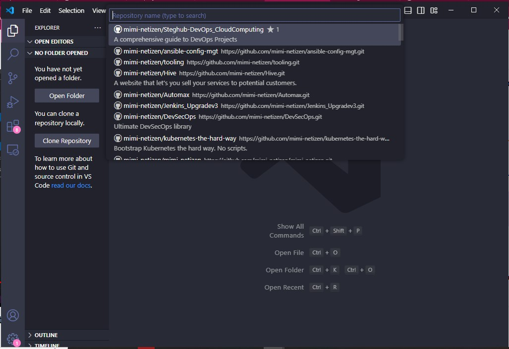
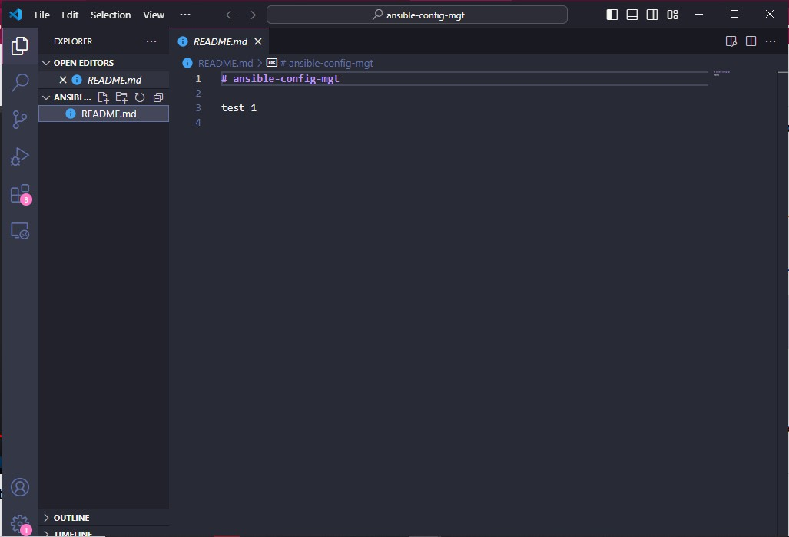

# Prepare your development environment using Visual Studio Code

1. First part of ‘DevOps’ is ‘Dev’, which means you will require to write some codes and you shall have proper tools that will make
   your coding and debugging comfortable – you need an Integrated development environment (IDE) or Source-code Editor. There is a
   plethora of different IDEs and Source-code Editors for different languages with their own advantages and drawbacks, you can choose
   whichever you are comfortable with, but we recommend one free and universal editor that will fully satisfy your needs –
   Visual Studio Code (VSC).


2. After you have successfully installed VSC, configure it to connect to your newly created GitHub repository. In the extension tab, install Remote Development.


3. Clone down your ansible-config-mgt repo to your Jenkins-Ansible instance

```powershell
git clone <ansible-config-mgt repo link>
```

Or open the files/folder on your vs code and click on clone repository




