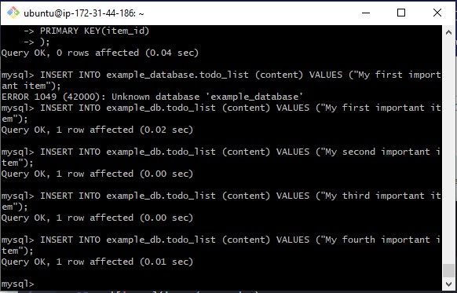
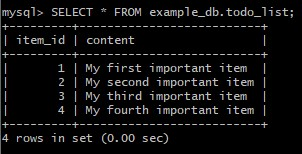

# Retrieving Data from MySQL Database with PHP

We will create a test database with simple "To do list" and configure access to it.  
We will create a database named `example_db` and a user named `example_user`.

First, we connect to the MySQL console using the root account

```bash
sudo mysql -u root -p
```

Then we create a new database

```bash
mysql> CREATE DATABASE `example_db`;
```

Then user

````bash
mysql> CREATE USER 'example_user'@'%' IDENTIFIED WITH mysql_native_password BY 'beautiful34';

Then permissions
```bash
mysql> GRANT ALL ON example_db.* TO 'example_user'@'%';


Next we create the todo_list table
```bash
CREATE TABLE example_db.todo_list (
    mysql>   item_id INT AUTO_INCREMENT,
    mysql>   content VARCHAR(255),
    mysql>   PRIMARY KEY(item_id)
    mysqql> );
````


We insert rows

```bash
mysql> INSERT INTO example_db.todo_list (content) VALUES ("My first important item");
mysql> INSERT INTO example_db.todo_list (content) VALUES ("My second important item");
mysql> INSERT INTO example_db.todo_list (content) VALUES ("My third important item");
mysql> INSERT INTO example_db.todo_list (content) VALUES ("My fourth important item");
```




Exit mysql  
Now we create a PHP script that will connect to MySQL and query for our content.

```bash
nano /var/www/projectLEMP/todo_list.php
```

Then paste

```bash
<?php
$user = "example_user";
$password = "beautiful34";
$database = "example_db";
$table = "todo_list";

try {
    $db = new PDO("mysql:host=localhost;dbname=$database", $user, $password);
    echo "<h2>TODO</h2><ol>";
    foreach($db->query("SELECT content FROM $table") as $row) {
        echo "<li>" . $row['content'] . "</li>";
    }
    echo "</ol>";
} catch (PDOException $e) {
    print "Error!: " . $e->getMessage() . "<br/>";
    die();
}
```

save and close file.

### Troubleshooting

When the PHP script queried the database there was an error "502 Bad Gateway" displayed on the browser. This is because the PHP version specified in the Nginx server configuration is php8.1 while the version of the PHP installed is php8.3

This was troubleshooted by updating the Nginx server configuration with PHP version php8.3
