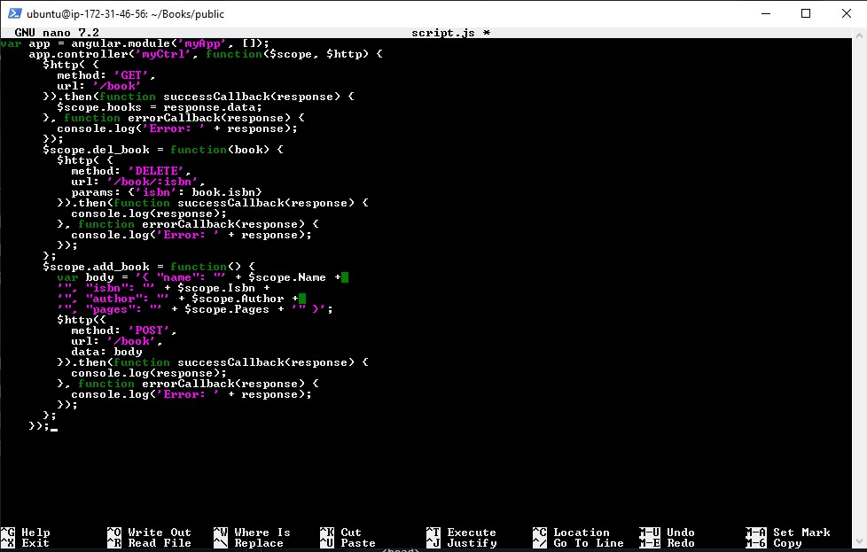
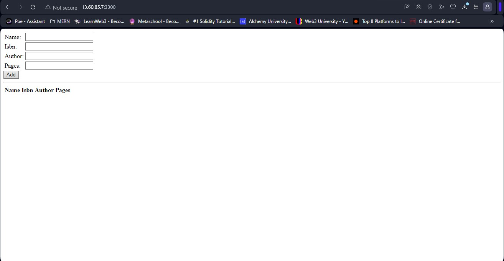

# Access the routes with AngularJs

Change directory back to Books  
Create a folder named public  
`mkdir public && cd public`

Add a file named script.js and paste

```powershell
var app = angular.module('myApp', []);
    app.controller('myCtrl', function($scope, $http) {
      $http( {
        method: 'GET',
        url: '/book'
      }).then(function successCallback(response) {
        $scope.books = response.data;
      }, function errorCallback(response) {
        console.log('Error: ' + response);
      });
      $scope.del_book = function(book) {
        $http( {
          method: 'DELETE',
          url: '/book/:isbn',
          params: {'isbn': book.isbn}
        }).then(function successCallback(response) {
          console.log(response);
        }, function errorCallback(response) {
          console.log('Error: ' + response);
        });
      };
      $scope.add_book = function() {
        var body = '{ "name": "' + $scope.Name +
        '", "isbn": "' + $scope.Isbn +
        '", "author": "' + $scope.Author +
        '", "pages": "' + $scope.Pages + '" }';
        $http({
          method: 'POST',
          url: '/book',
          data: body
        }).then(function successCallback(response) {
          console.log(response);
        }, function errorCallback(response) {
          console.log('Error: ' + response);
        });
      };
    });
```



In public folder create index.html and paste

```powershell
   <!doctype html>
 <html ng-app="myApp" ng-controller="myCtrl">
   <head>
     <script src="https://ajax.googleapis.com/ajax/libs/angularjs/1.6.4/angular.min.js"></script>
     <script src="script.js"></script>
   </head>
   <body>
     <div>
       <table>
         <tr>
           <td>Name:</td>
           <td><input type="text" ng-model="Name"></td>
         </tr>
         <tr>
           <td>Isbn:</td>
           <td><input type="text" ng-model="Isbn"></td>
         </tr>
         <tr>
           <td>Author:</td>
           <td><input type="text" ng-model="Author"></td>
         </tr>
         <tr>
           <td>Pages:</td>
           <td><input type="number" ng-model="Pages"></td>
         </tr>
       </table>
       <button ng-click="add_book()">Add</button>
     </div>
     <hr>
     <div>
       <table>
         <tr>
           <th>Name</th>
           <th>Isbn</th>
           <th>Author</th>
           <th>Pages</th>
         </tr>
         <tr ng-repeat="book in books">
           <td>{{book.name}}</td>
           <td>{{book.isbn}}</td>
           <td>{{book.author}}</td>
           <td>{{book.pages}}</td>
           <td><input type="button" value="Delete" ng-click="del_book(book)"></td>
         </tr>
       </table>
     </div>
   </body>
 </html>
```


Change directory back to Books and start server  
 `node server.js`


output




