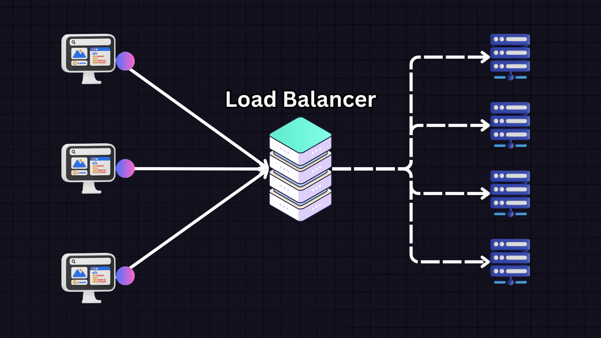

# Load Balancing: Optimizing Performance and Reliability

## Introduction

In today's digital landscape, where websites and applications are expected to deliver seamless user experiences, load balancing has become a critical component of any robust infrastructure. Load balancing refers to the distribution of incoming network traffic across multiple servers to ensure optimal performance, high availability, and reliability. By intelligently distributing the workload, load balancing helps prevent server overload, reduces downtime, and enhances scalability.

We will now explore the concept of load balancing, its benefits, different load balancing techniques, and how it can be effectively implemented to optimize performance and reliability.

### Table of Contents

1. [What is Load Balancing?](#what-is-load-balancing)
2. [Benefits of Load Balancing](#benefits-of-load-balancing)
3. [Load Balancing Techniques](#load-balancing-techniques)
   1. [Round Robin](#round-robin)
   2. [Least Connection](#least-connection)
   3. [Weighted Round Robin](#weighted-round-robin)
   4. [IP Hash](#ip-hash)
4. [Implementing Load Balancing](#implementing-load-balancing)
5. [FAQ](#faq)
   1. [What is server overload?](#what-is-server-overload)
   2. [How does load balancing prevent server overload?](#how-does-load-balancing-prevent-server-overload)
   3. [Can load balancing improve scalability?](#can-load-balancing-improve-scalability)
   4. [What is high availability in the context of load balancing?](#what-is-high-availability-in-the-context-of-load-balancing)
   5. [Is load balancing only applicable to web servers?](#is-load-balancing-only-applicable-to-web-servers)

### What is Load Balancing? 

Load balancing is a technique used to distribute incoming network traffic across multiple servers or resources to ensure optimal utilization and performance. It acts as a mediator between the client and the server, intelligently routing requests to the most appropriate server based on various factors such as server health, current load, and proximity. By evenly distributing the workload, load balancing prevents any single server from becoming overwhelmed, thereby reducing the risk of downtime and improving overall system performance.

### Benefits of Load Balancing 

#### 1. Enhanced Performance

One of the primary benefits of load balancing is improved performance. By distributing incoming traffic across multiple servers, load balancing ensures that no single server is overloaded with requests. This results in faster response times and improved user experience. Load balancing also allows for efficient resource utilization, as it enables servers to handle a higher volume of requests without compromising performance.

#### 2. High Availability and Reliability

Load balancing plays a crucial role in ensuring high availability and reliability of services. By distributing traffic across multiple servers, load balancing eliminates single points of failure. If one server fails or becomes unavailable, the load balancer automatically redirects traffic to other available servers, minimizing downtime and ensuring uninterrupted service for users.

#### 3. Scalability

Load balancing enables horizontal scalability by allowing new servers to be added to the infrastructure seamlessly. As the demand for resources increases, additional servers can be added to the pool, and the load balancer will intelligently distribute the workload across all available servers. This scalability ensures that the system can handle increased traffic and maintain optimal performance even during peak usage periods.

#### 4. Flexibility and Adaptability

Load balancing provides flexibility and adaptability to the infrastructure. It allows for easy addition or removal of servers without affecting the overall system performance. This flexibility enables organizations to scale their infrastructure based on changing demands, ensuring that resources are efficiently utilized and costs are optimized.

### Load Balancing Techniques 

There are various load balancing techniques that can be employed based on the specific requirements of the infrastructure. Let's explore some commonly used techniques:

#### 1. Round Robin 

Round Robin is a simple and widely used load balancing technique. In this method, incoming requests are distributed across servers in a cyclic manner. Each server is assigned a turn to handle the incoming request, and subsequent requests are distributed sequentially. Round Robin is easy to implement and ensures an equal distribution of requests among servers. However, it does not take into account the server's current load or performance, which can lead to inefficient resource allocation.

#### 2. Least Connection 

The Least Connection method directs incoming requests to the server with the fewest active connections at the time of the request. This technique ensures that the workload is distributed evenly among servers based on their current load. By dynamically adjusting theweightage of each server based on the number of connections, the load balancer can effectively distribute the load and prevent any single server from becoming overwhelmed.

#### 3. Weighted Round Robin 

Weighted Round Robin is an extension of the Round Robin technique that assigns a weight or priority to each server in the pool. Servers with higher weights receive a larger proportion of incoming requests, while servers with lower weights handle a smaller portion. This technique allows for more granular control over the distribution of workload, enabling administrators to allocate resources based on server capacity and performance.

#### 4. IP Hash 

The IP Hash method uses the client's IP address to determine which server should handle the request. The load balancer calculates a hash value based on the client's IP address and uses it to select the server. This technique ensures that requests from the same client are consistently routed to the same server, maintaining session persistence. IP Hash is commonly used in scenarios where maintaining session state is crucial, such as e-commerce applications.

### Implementing Load Balancing 

Implementing load balancing requires careful planning and consideration of the specific needs of the infrastructure. Here are some key steps to follow:

1. **Identify the Load Balancing Strategy**: Determine the load balancing technique that best suits your infrastructure and application requirements. Consider factors such as scalability, performance, and session persistence.

2. **Choose a Load Balancer**: Select a load balancing solution that aligns with your infrastructure and budget. There are hardware-based load balancers, software-based load balancers, and cloud-based load balancers available. Evaluate their features, scalability, and ease of management before making a decision.

3. **Configure Load Balancer**: Set up the load balancer by configuring the necessary parameters such as server health checks, load balancing algorithms, and session persistence settings. Ensure that the load balancer is properly integrated with your servers and network infrastructure.

4. **Monitor and Optimize**: Regularly monitor the performance of your load balancer and make necessary adjustments to optimize its efficiency. Keep an eye on server health, traffic patterns, and response times to identify any bottlenecks or performance issues.

5. **Scale as Needed**: As your infrastructure grows and demands increase, be prepared to scale your load balancing solution accordingly. Add additional servers or upgrade your load balancer to accommodate the increased workload.

By following these steps, organizations can effectively implement load balancing and reap the benefits of improved performance, high availability, and scalability.

### FAQ 

#### 1. What is server overload? 

Server overload refers to a situation where a server is unable to handle the incoming requests or workload due to resource limitations. It can lead to slow response times, system crashes, and overall degradation of performance.

#### 2. How does load balancing prevent server overload? 

Load balancing prevents server overload by distributing incoming requests across multiple servers. This ensures that no single server is overwhelmed with traffic, allowing for efficient resource utilization and improved performance. If one server becomes overloaded or unavailable, the load balancer redirects traffic to other available servers, preventing downtime and maintaining service availability.

#### 3. Can load balancing improve scalability? 

Yes, load balancing plays a crucial role in improving scalability. By distributing the workload across multiple servers, load balancing enables organizations to handle increased traffic and scale their infrastructure seamlessly. New servers can be added to the pool, and the load balancer will intelligently distribute the workload, ensuring optimal performance and scalability.

#### 4. What is high availability in the context of load balancing? 

High availability in load balancing refers to the ability of the infrastructure to provide uninterrupted service even in the event of server failures or downtime. By distributing traffic across multiple servers, load balancing eliminates single points of failure and ensures that services remain available to users.

#### 5. Is load balancing only applicable to web servers? 

No, load balancing is not limited to web servers. While it is commonly used in web server environments to handle HTTP requests, load balancing can be applied to various types of servers and services, including database servers, application servers, and email servers. It helps optimize performance and ensure high availability for any resource-intensive workload.

### Conclusion

Load balancing is a crucial component of modern infrastructure, enabling organizations to optimize performance, enhance reliability, and improve scalability. By intelligently distributing incoming traffic across multiple servers, load balancing ensures efficient resource utilization, prevents server overload, and provides high availability for services. With various load balancing techniques available, organizations can choose the most suitable approach based on their specific needs. By implementing
