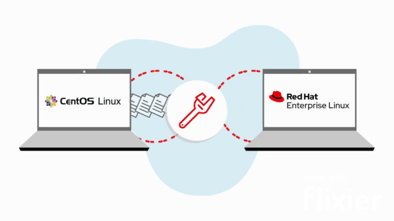

# Comprehensive Guide to CentOS

## What is CentOS?

CentOS is a Linux distribution derived from the sources of Red Hat Enterprise Linux (RHEL). It aims to provide a free, enterprise-class computing platform that is functionally compatible with its upstream source, RHEL. CentOS is widely used in server environments due to its stability, security, and long-term support.



### Key Features of CentOS

- **Stability and Reliability**: CentOS is known for its stability and reliability, making it suitable for mission-critical applications.
- **Security**: CentOS includes advanced security features such as SELinux, firewall management, and regular security updates.
- **Long-Term Support**: CentOS provides long-term support with regular updates and security patches.
- **Community Support**: A large and active community offers support, documentation, and resources.

## Benefits of Using CentOS

Using CentOS in your enterprise environment offers several advantages:

- **Cost-Effective**: CentOS is free to use, making it a cost-effective solution for enterprise environments.
- **Enterprise-Grade Security**: Advanced security features help protect your systems and data.
- **Compatibility with RHEL**: CentOS is functionally compatible with RHEL, allowing for seamless integration with RHEL-based systems.
- **Extensive Documentation**: Comprehensive documentation and community resources are available to help with installation, configuration, and management.

## Installing CentOS

### Prerequisites

Before installing CentOS, ensure that your system meets the minimum hardware requirements and that you have a valid download of the CentOS ISO.

### Installation Steps

1. **Download CentOS**: Obtain the CentOS ISO from the [official CentOS website](https://www.centos.org/download/).
2. **Create Bootable Media**: Use a tool like `dd` or `Rufus` to create a bootable USB drive or DVD.
3. **Boot from Installation Media**: Insert the bootable media and restart your system. Select the boot option for the installation media.
4. **Follow Installation Wizard**: The CentOS installation wizard will guide you through the installation process. Choose your language, configure your network, and partition your disk.
5. **Complete Installation**: After installation, configure your system settings and create a user account.

## Managing CentOS

### Package Management

CentOS uses the `yum` package manager for installing, updating, and removing software packages.

1. **Install a Package**:

   ```bash
   sudo yum install package_name
   ```

2. **Update All Packages**:

   ```bash
   sudo yum update
   ```

3. **Remove a Package**:
   ```bash
   sudo yum remove package_name
   ```

### User and Group Management

Managing users and groups is essential for maintaining security and access control.

1. **Add a New User**:

   ```bash
   sudo useradd username
   sudo passwd username
   ```

2. **Add a User to a Group**:

   ```bash
   sudo usermod -aG groupname username
   ```

3. **Delete a User**:
   ```bash
   sudo userdel username
   ```

### System Monitoring

Monitoring system performance and resource usage is crucial for maintaining a healthy environment.

1. **Check System Load**:

   ```bash
   uptime
   ```

2. **Monitor Processes**:

   ```bash
   top
   ```

3. **Check Disk Usage**:
   ```bash
   df -h
   ```

### Security Management

CentOS includes several tools and features for enhancing system security.

1. **Configure Firewall**:

   ```bash
   sudo firewall-cmd --add-service=http --permanent
   sudo firewall-cmd --reload
   ```

2. **Enable SELinux**:

   ```bash
   sudo setenforce 1
   ```

3. **Install Security Updates**:
   ```bash
   sudo yum update --security
   ```

## Optimizing CentOS

### Performance Tuning

Optimizing CentOS for performance involves tuning various system parameters.

1. **Adjust Swappiness**:

   ```bash
   sudo sysctl vm.swappiness=10
   ```

2. **Optimize Disk I/O**:
   ```bash
   sudo tuned-adm profile throughput-performance
   ```

### Resource Management

Efficient resource management ensures that your system runs smoothly.

1. **Limit CPU Usage**:
   ```bash
   sudo cpul
   ```
