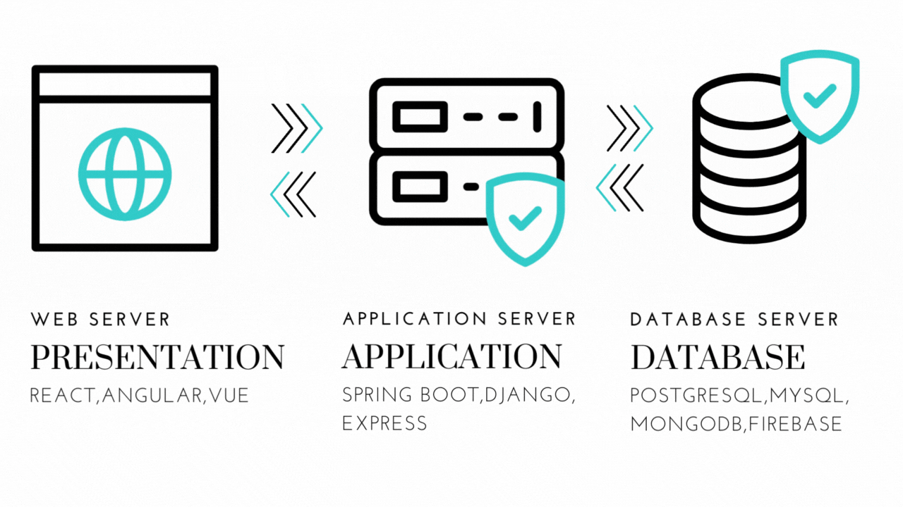
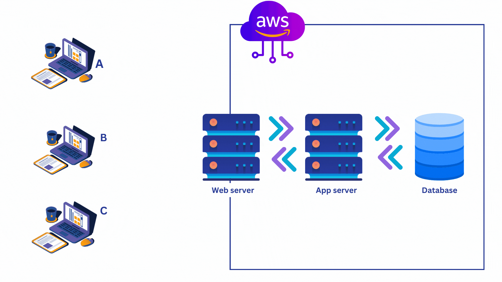
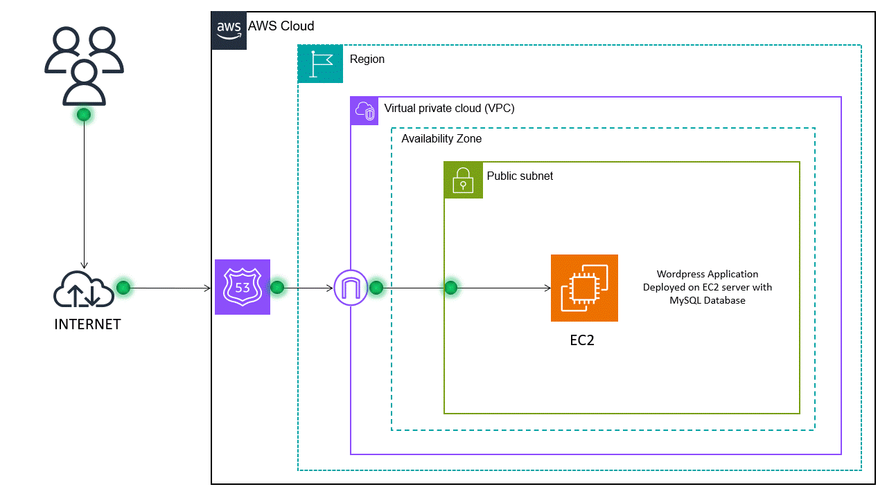

# Web Solution With WordPress: Implementing Three-Tier Architecture

## Introduction

In the realm of web development, structuring your application for scalability, maintainability, and performance is crucial. One of the most effective ways to achieve this is through a three-tier architecture. We will go through the process of implementing a three-tier architecture for a web solution using WordPress, ensuring that our application is robust and efficient.

## What is Three-Tier Architecture?

Three-tier architecture is a client-server architecture that divides an application into three logical layers:

- the presentation layer
- the application layer
- data layer.

Each layer is responsible for specific tasks and can be developed, managed, and maintained independently.



### Layers of Three-Tier Architecture

1. **Presentation Layer**: This is the user interface layer where users interact with the application. In a WordPress context, this includes themes and front-end components.
2. **Application Layer**: Also known as the business logic layer, this layer processes user inputs, makes logical decisions, and performs calculations. In WordPress, this includes plugins and custom code.
3. **Data Layer**: This layer is responsible for data storage and management. It interacts with the database to retrieve, store, and update data. For WordPress, this typically involves MySQL or MariaDB databases.

## Benefits of Three-Tier Architecture

Implementing a three-tier architecture offers several advantages:

- **Scalability**: Each layer can be scaled independently based on demand.
- **Maintainability**: Separation of concerns makes it easier to manage and update each layer.
- **Security**: Sensitive data can be isolated in the data layer, enhancing security.
- **Flexibility**: Each layer can be developed and deployed independently, allowing for more flexible development processes.

# Setting Up and Deploying a Three-Tier Architecture with WordPress



Deploying a dynamic WordPress application on AWS using a three-tier architecture is an excellent way to ensure scalability, reliability, and security. This architecture separates the application into three layers: the presentation layer, the application logic layer, and the data layer. This separation allows for better management and scaling of each component independently.

We will now go through the process of deploying a dynamic [WordPress](https://wordpress.org/) application on [AWS](https://aws.amazon.com/) using a three-tier architecture. This approach enhances the performance, security, and scalability of your WordPress site.

## Setting Up the Presentation Layer

The presentation layer will be hosted on an EC2 instance running a web server (e.g., Apache or Nginx).

### Steps:

1. **Launch an EC2 Instance**:

   - Go to the [AWS Management Console](https://aws.amazon.com/console/).
   - Launch a new EC2 instance with an appropriate Amazon Machine Image (AMI).
   - Configure security groups to allow HTTP and HTTPS traffic.

2. **Install Web Server**:

   - SSH into the EC2 instance.
   - Install Apache or Nginx:
     ```bash
     sudo yum update -y
     sudo yum install httpd -y
     sudo systemctl start httpd
     sudo systemctl enable httpd
     ```

3. **Download and Configure WordPress**:
   - Download WordPress:
     ```bash
     wget https://wordpress.org/latest.tar.gz
     tar -xzf latest.tar.gz
     sudo mv wordpress/* /var/www/html/
     sudo chown -R apache:apache /var/www/html/
     sudo chmod -R 755 /var/www/html/
     ```

## Configuring the Application Logic Layer

The application logic layer will also be hosted on an EC2 instance, which will handle the PHP processing.

### Steps:

1. **Launch an EC2 Instance**:

   - Launch another EC2 instance for the application logic layer.

2. **Install PHP and Required Extensions**:

   - SSH into the instance and install PHP:
     ```bash
     sudo yum install php php-mysql -y
     sudo systemctl restart httpd
     ```

3. **Configure WordPress to Use the Application Server**:
   - Modify the `wp-config.php` file to point to the application server.

## Establishing the Data Layer

The data layer will be managed by Amazon RDS, which provides a scalable and managed database service.

### Steps:

1. **Create an RDS Instance**:

   - Go to the [RDS Console](https://aws.amazon.com/rds/).
   - Create a new RDS instance with MySQL or MariaDB.
   - Configure security groups to allow connections from the application server.

2. **Configure WordPress Database Settings**:
   - Update the `wp-config.php` file with the RDS endpoint, database name, username, and password.

## Connecting the Layers

### Steps:

1. **Update Security Groups**:

   - Ensure that the security groups for the EC2 instances and RDS instance allow the necessary traffic.

2. **Test the Connection**:
   - Access the WordPress site via the web server's public IP or domain name.
   - Complete the WordPress installation process by entering the database details.

## Security Considerations

- **Use IAM Roles**: Assign appropriate IAM roles to EC2


