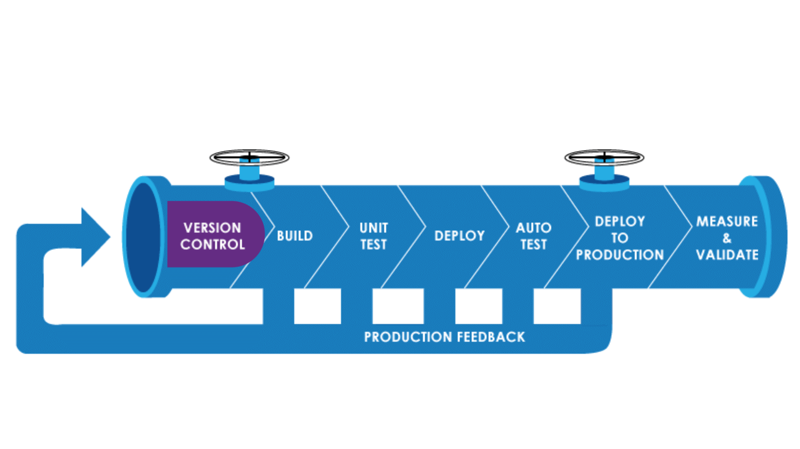

# CI/CD: Streamlining Software Development and Deployment

Welcome to the world of Continuous Integration and Continuous Deployment (CI/CD), a set of practices and tools that streamline the software development and deployment process. In this article, we will explore the benefits and best practices of CI/CD and how it enables organizations to deliver high-quality software at a rapid pace. So, let's dive in and discover the wonders of CI/CD!

## What is CI/CD?

CI/CD is a software development approach that emphasizes frequent integration of code changes, automated testing, and continuous deployment to production environments. It involves the use of various tools and practices to automate the build, test, and deployment processes, ensuring that software changes are quickly and reliably delivered to end-users.

## Key Components of CI/CD

### 1. Continuous Integration (CI)

Continuous Integration is the practice of merging code changes from multiple developers into a shared repository frequently. This ensures that the codebase is always up-to-date and that any conflicts or issues are detected early. CI relies on automated build and test processes to verify the integrity of the codebase.

### 2. Automated Testing

Automated testing is a crucial aspect of CI/CD. It involves the use of automated test frameworks and tools to execute various types of tests, such as unit tests, integration tests, and end-to-end tests. Automated testing helps identify bugs and regressions early in the development cycle, ensuring that software changes meet the required quality standards.

### 3. Continuous Deployment (CD)

Continuous Deployment is the practice of automatically deploying software changes to production environments after passing the necessary tests. CD relies on automated deployment pipelines that build, package, and deploy applications to production environments in a consistent and repeatable manner. This allows organizations to release new features and bug fixes rapidly.

### 4. Version Control

Version control is a fundamental component of CI/CD. It involves the use of a version control system, such as Git, to track and manage code changes. Version control enables collaboration among developers, provides a history of code changes, and allows for easy rollback in case of issues.

### 5. Monitoring and Feedback

Monitoring and feedback play a crucial role in CI/CD. Continuous monitoring of applications in production environments helps identify performance issues, errors, and other anomalies. Feedback loops, such as user feedback and automated testing results, provide valuable insights for improving the software development process.

## Benefits of CI/CD

Implementing CI/CD practices and tools offers several benefits to organizations:

### 1. Faster Time to Market

CI/CD enables organizations to deliver software changes quickly and frequently. By automating the build, test, and deployment processes, developers can focus on writing code, while the CI/CD pipeline takes care of the rest. This reduces the time required to release new features and bug fixes, allowing organizations to stay ahead of the competition.

### 2. Improved Code Quality

Automated testing in CI/CD ensures that code changes are thoroughly tested before being deployed to production. This helps catch bugs and regressions early in the development cycle, preventing them from reaching end-users. By maintaining a high level of code quality, organizations can deliver reliable and stable software to their customers.

### 3. Increased Collaboration and Transparency

CI/CD promotes collaboration among developers by encouraging frequent code integration and providing a shared code repository. This allows developers to work on different features concurrently and reduces the chances of code conflicts. Additionally, CI/CD provides transparency into the development process, as developers can easily track code changes and their impact.

### 4. Rapid Feedback and Issue Resolution

CI/CD enables rapid feedback loops through automated testing and monitoring. Developers receive immediate feedback on the quality and functionality of their code, allowing them to address issues promptly. This iterative feedback loop helps improve the software development process and ensures that customer requirements are met effectively.

### 5. Continuous Improvement

CI/CD fosters a culture of continuous improvement within organizations. By automating processes and collecting feedback, organizations can identify areas for improvement and make iterative changes to their development and deployment pipelines. This leads to increased efficiency, productivity, and customer satisfaction over time.

## Best Practices for Implementing CI/CD

To effectively implement CI/CD, consider the following best practices:

### 1. Automate as Much as Possible

Automate the build, test, and deployment processes as much as possible. Use tools like Jenkins, GitLab CI/CD, or CircleCI to create automated pipelines that execute tests and deploy applications. This reduces the chances of human error and ensures consistency in the development and deployment processes.

### 2. Use Version Control and Branching Strategies

Utilize a version control system like Git and establish clear branching strategies. Use feature branches for development and merge them into a main branch once the code changes have been tested and reviewed. This helps maintain a clean and stable codebase.

### 3. Implement Comprehensive Testing

Implement a robust testing strategy that includes unit tests, integration tests, and end-to-end tests. Use testing frameworks like JUnit
