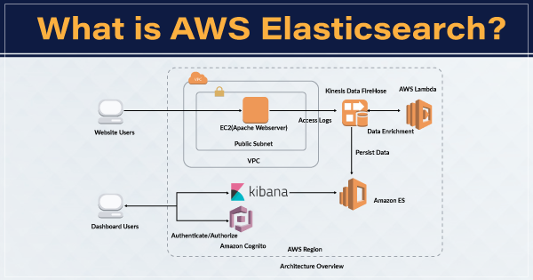

# Elasticsearch: Empowering Search and Analytics

Elasticsearch is an open-source, distributed search and analytics engine built on top of Apache Lucene. It is designed to handle large volumes of data and provide near real-time search and analytics capabilities. Elasticsearch is known for its speed, scalability, and ease of use, making it a popular choice for a wide range of applications.

## Key Features of Elasticsearch

### 1. Full-Text Search

Elasticsearch excels at full-text search, allowing you to quickly and accurately search through large volumes of text-based data. It supports advanced search features like fuzzy matching, phrase matching, and relevance scoring, providing highly relevant search results.

### 2. Distributed and Scalable

Elasticsearch is designed to be distributed and scalable, allowing you to horizontally scale your cluster as your data grows. It automatically distributes data across multiple nodes, ensuring high availability and fault tolerance. This makes Elasticsearch suitable for handling large-scale applications and big data analytics.

### 3. Near Real-Time Analytics

Elasticsearch provides near real-time analytics capabilities, allowing you to analyze and visualize your data in seconds. It supports aggregations, which enable you to perform complex calculations, grouping, and filtering on your data. With Elasticsearch, you can gain valuable insights from your data and make data-driven decisions.

### 4. Schemaless and Flexible

Elasticsearch is schemaless, meaning you can index and search data without having to define a strict schema upfront. This flexibility allows you to easily adapt to changing data requirements and iterate on your data model. You can index structured, unstructured, and semi-structured data, making Elasticsearch suitable for a wide range of use cases.

### 5. RESTful API

Elasticsearch provides a RESTful API, making it easy to interact with the engine using simple HTTP requests. This API allows you to perform various operations, such as indexing, searching, updating, and deleting documents. The RESTful nature of Elasticsearch simplifies integration with other systems and programming languages.

## Use Cases of Elasticsearch

Elasticsearch is used in a variety of applications and industries. Here are some common use cases:

### 1. Search Engines

Elasticsearch's powerful search capabilities make it an ideal choice for building search engines. Whether it's a website search, e-commerce product search, or enterprise search, Elasticsearch can deliver fast and accurate search results.

### 2. Log Analytics

Elasticsearch is widely used for log analytics, allowing organizations to collect, index, and analyze log data in real-time. By centralizing logs in Elasticsearch, you can easily search, visualize, and monitor your logs, enabling faster troubleshooting and proactive monitoring.

### 3. Business Intelligence and Analytics

With its near real-time analytics capabilities, Elasticsearch is a valuable tool for business intelligence and analytics. It enables you to perform complex aggregations, visualize data, and build interactive dashboards. Elasticsearch integrates well with popular visualization tools like Kibana, making it a powerful solution for data exploration and analysis.

### 4. Recommendation Systems

Elasticsearch's search capabilities can be leveraged to build recommendation systems. By analyzing user behavior and preferences, Elasticsearch can provide personalized recommendations for products, content, or similar items. This helps improve user engagement and drives conversions.

### 5. Monitoring and Alerting

Elasticsearch, along with its monitoring and alerting companion tool called Elasticsearch Watcher, can be used to monitor system metrics, application performance, and security events. It allows you to set up custom alerts based on predefined conditions, helping you proactively identify and resolve issues.

## Getting Started with Elasticsearch

To get started with Elasticsearch, follow these steps:

1. Download and install Elasticsearch on your preferred platform.
2. Familiarize yourself with the Elasticsearch documentation and learn about its core concepts and APIs.
3. Start Elasticsearch and configure the cluster settings, such as the number of nodes and network settings.
4. Use the Elasticsearch API to index, search, and analyze data. Experiment with different query types and aggregations to explore the capabilities of Elasticsearch.
5. Integrate Elasticsearch with other tools like Kibana for data visualization and Logstash for data ingestion and transformation.
6. Consider using Elasticsearch in combination with other components of the Elastic Stack, such as Beats for data collection and APM for application performance monitoring.
7. Explore the Elasticsearch ecosystem and community to learn about additional plugins, libraries, and use cases.

## Conclusion

Elasticsearch is a powerful search and analytics engine that empowers organizations to harness the full potential of their data. With its speed, scalability, and flexibility, Elasticsearch is a versatile tool for a wide range of applications, from search engines to log analytics and business intelligence. So, embrace the power of Elasticsearch and unlock valuable insights fromyour data, enabling faster decision-making and driving business success.
