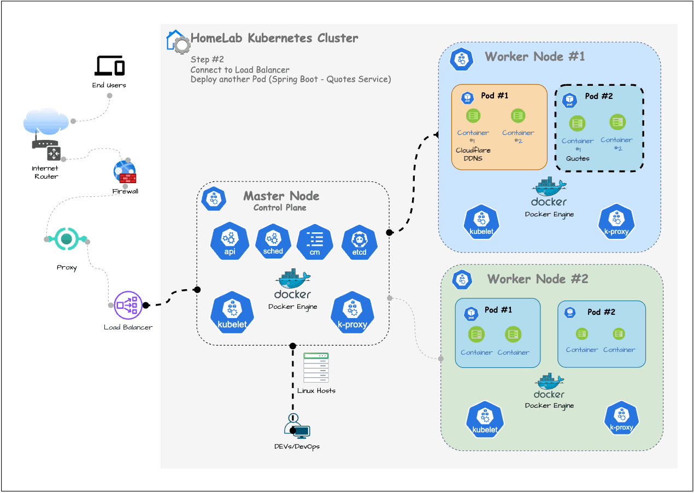
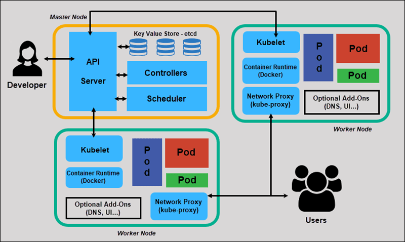

# Kubernetes: Revolutionizing Container Orchestration

In the world of modern application development, containerization has gained immense popularity due to its ability to package applications and their dependencies into isolated units. However, managing and orchestrating these containers at scale can be a complex task. This is where Kubernetes comes in.

Kubernetes, also known as K8s, is an open-source container orchestration platform that simplifies the deployment, scaling, and management of containerized applications. In this comprehensive guide, we will explore the features and benefits of Kubernetes, as well as provide a step-by-step tutorial on how to set it up and use it effectively.

## Table of Contents

1. [What is Kubernetes?](#what-is-kubernetes)
2. [Why Use Kubernetes?](#why-use-kubernetes)
3. [Setting Up Kubernetes](#setting-up-kubernetes)
4. [Understanding Kubernetes Architecture](#understanding-kubernetes-architecture)
5. [Deploying Applications with Kubernetes](#deploying-applications-with-kubernetes)
6. [Scaling and Load Balancing with Kubernetes](#scaling-and-load-balancing-with-kubernetes)
7. [Managing Storage with Kubernetes](#managing-storage-with-kubernetes)
8. [Monitoring and Logging with Kubernetes](#monitoring-and-logging-with-kubernetes)

## What is Kubernetes?

Kubernetes is an open-source container orchestration platform developed by Google. It provides a robust and scalable solution for automating the deployment, scaling, and management of containerized applications. Kubernetes abstracts away the underlying infrastructure and provides a unified API for managing containers, making it easier to deploy and manage applications in a distributed environment.

## Why Use Kubernetes?

There are several reasons why Kubernetes has become the de facto standard for container orchestration:

1. **Scalability**: Kubernetes allows you to scale your applications effortlessly. It can automatically scale your application based on resource utilization or predefined metrics, ensuring optimal performance.

2. **Fault Tolerance**: Kubernetes ensures high availability of your applications by automatically restarting failed containers, replacing unhealthy nodes, and distributing workload evenly across the cluster.

3. **Service Discovery and Load Balancing**: Kubernetes provides built-in service discovery and load balancing mechanisms, making it easy to expose your application services and distribute traffic across multiple instances.

4. **Rolling Updates and Rollbacks**: Kubernetes supports rolling updates, allowing you to update your application without downtime. It also enables easy rollbacks in case of issues during the update process.

5. **Storage Orchestration**: Kubernetes provides a flexible and scalable storage orchestration layer, allowing you to attach and mount persistent storage to your containers.

6. **Extensibility**: Kubernetes has a vast ecosystem of plugins and extensions, allowing you to integrate with various tools and services for logging, monitoring, security, and more.

## Setting Up Kubernetes

Setting up a Kubernetes cluster can be done on various platforms, including local machines, cloud providers, and on-premises infrastructure. Here is a high-level overview of the steps involved in setting up Kubernetes:

1. **Choose a Platform**: Decide on the platform where you want to set up your Kubernetes cluster. Options include local development environments like Minikube, cloud providers like Google Kubernetes Engine (GKE) or Amazon Elastic Kubernetes Service (EKS), or on-premises infrastructure using tools like kubeadm.

2. **Provision Nodes**: Set up the required number of nodes based on your application's scalability and resource requirements. Nodes can be virtual machines or physical servers.

3. **Install Kubernetes**: Install the Kubernetes control plane components, including the API server, scheduler, and controller manager, on the master node. Install the Kubernetes worker components, including the kubelet and kube-proxy, on each worker node.

4. **Configure Networking**: Set up a networking solution that allows communication between the nodes and enables services to be exposed externally. Popular networking solutions for Kubernetes include Calico, Flannel, and Weave.

5. **Join Nodes to the Cluster**: Join the worker nodes to the cluster by running a command or providing a token generated during the cluster setup. This allows the worker nodes to become part of the Kubernetes cluster.

6. **Verify Cluster Setup**: Verify the cluster setup by running basic commands to ensure that the control plane and worker nodes are functioning correctly.

## Understanding Kubernetes Architecture

To effectively use Kubernetes, it is essential to understand its architecture. Kubernetes follows a master-worker architecture, where the master node manages the cluster and the worker nodes run the applications. Here are the key components of the Kubernetes architecture:

1. **Master Node**: The master node is responsible for managing the cluster. It includes the API server, which acts as the primary control interface for Kubernetes, the scheduler, which assigns workloads to worker nodes, and the controller manager, which handles cluster-level functions such as scaling, replication, and monitoring.

2. **Worker Node**: The worker nodes are responsible for running the applications. Each worker node has the following components:

   - **Kubelet**: The kubelet is an agent that runs on each worker node and communicates with the master node. It manages the containers on the node and ensures they are running correctly.

   - **Kube-proxy**: The kube-proxy is responsible for network proxying on each worker node. It handles the routing of network traffic to the appropriate containers.

   - **Container Runtime**: The container runtime, such as Docker or containerd, is responsible for running the containers on the worker node.

3. **Pod**: A pod is the smallest deployable unit in Kubernetes. It represents a single instance of a running process in the cluster. A pod can contain one or more containers that share the same network namespace and storage volumes.

4. **Service**: A service is an abstraction that defines a logical set of pods and a policy by which to access them. It provides a stable network endpoint for accessing the pods, even if the underlying pods are scaled or replaced.

5. **Volume**: A volume is a directory accessible to containers in a pod. It can be used to store data that needs to persist across container restarts or to share data between containers in the same pod.

## Deploying Applications with Kubernetes

Deploying applications with Kubernetes involves creating a deployment, which defines the desired state of the application, and then letting Kubernetes manage the deployment and scaling of the application. Here are the steps involved in deploying an application:

1. **Create a Deployment**: Define a deployment manifest that specifies the container image, resource requirements, and other configuration options for the application.

2. **Apply the Deployment**: Use the `kubectl apply` command to apply the deployment manifest and create the deployment in the cluster.

3. **Scale the Deployment**: Use the `kubectl scale` command to scale the deployment by increasing or decreasing the number of replicas.

4. **Expose the Deployment**: Expose the deployment as a service using the `kubectl expose` command. This allows external traffic to reach the application.

5. **Monitor the Deployment**: Monitor the deployment using Kubernetes' built-in monitoring tools or integrate with external monitoring solutions for better visibility into the application's performance.

## Scaling and Load Balancing with Kubernetes

One of the key benefits of Kubernetes is its ability to scale applications based on demand. Kubernetes provides several mechanisms for scaling and load balancing:

1. **Horizontal Pod Autoscaling (HPA)**: HPA automatically scales the number of pods in a deployment based on CPU utilization or custom metrics. It ensures that the application can handle increased traffic without manual intervention.

2. **Cluster Autoscaling**: Cluster autoscaling scales the number of worker nodes in the cluster based on resource utilization. It allows the cluster to dynamically adjust its capacity to meet the demands of the applications running on it.

3. **Service Load Balancing**: Kubernetes provides built-in load balancing for services. When a service is exposed, Kubernetes automatically distributes incoming traffic to the available pods, ensuring that the workload is evenly balanced.

4. **Ingress**: Ingress is an API object that manages external access to services within a cluster. It acts as a reverse proxy and allows you to define routing rules, SSL termination, and other advanced features for incoming traffic.

## Managing Storage with Kubernetes

Kubernetes provides various options for managing storage in a cluster. Here are some key storage-related concepts in Kubernetes:

1. **Persistent Volumes (PV)**: A persistent volume is a piece of storage in the cluster that has a lifecycle independent of any individual pod. It allows data to persist across pod restarts and can be dynamically provisioned or statically defined.

2. **Persistent Volume Claims (PVC)**: A persistent volume claim is a request for storage by a user or a pod. It binds to a persistent volume and provides a way to consume the storage resources defined by the persistent volume.

3. **Storage Classes**: Storage classes are used to define different types of storage that can be dynamically provisioned by Kubernetes. They allow administrators to define the characteristics of the storage, such as performance, durability, and access mode.

4. **Volume Plugins**: Kubernetes supports various volume plugins, such as NFS, iSCSI, and AWS EBS, that allow you to attach and mount external storage to your containers.

## Monitoring and Logging with Kubernetes

Monitoring and logging are crucial for maintaining the health and performance of applications running in a Kubernetes cluster. Kubernetes provides several built-in tools and integrations for monitoring and logging:

1. **Metrics Server**: Metrics Server is a built-in Kubernetes component that collects resource utilization metrics from the cluster's nodes and pods. It exposes these metrics via the Kubernetes API, allowing you to retrieve them using the `kubectl top` command or integrate with external monitoring tools.

2. **Prometheus**: Prometheus is a popular open-source monitoring system that can be integrated with Kubernetes. It collects metrics from various sources, including Kubernetes,
