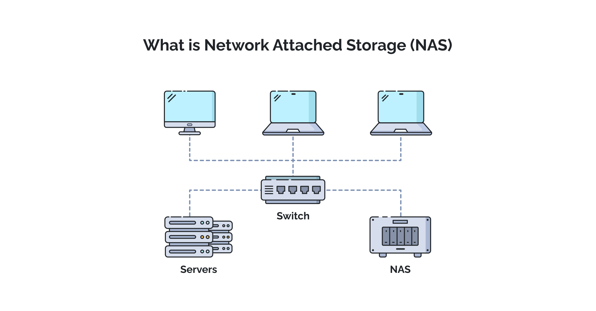
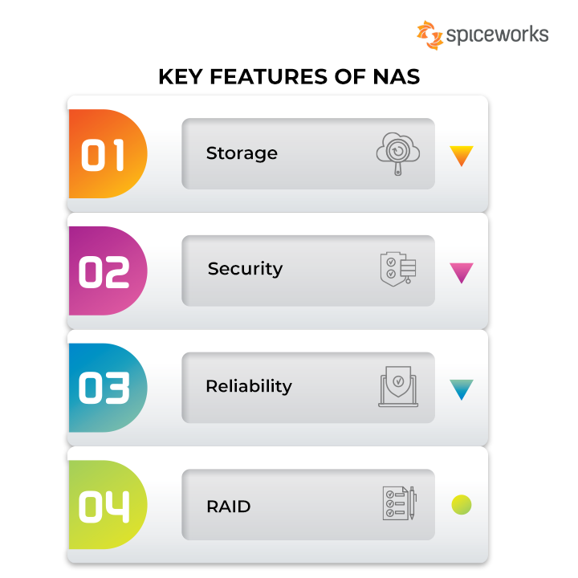
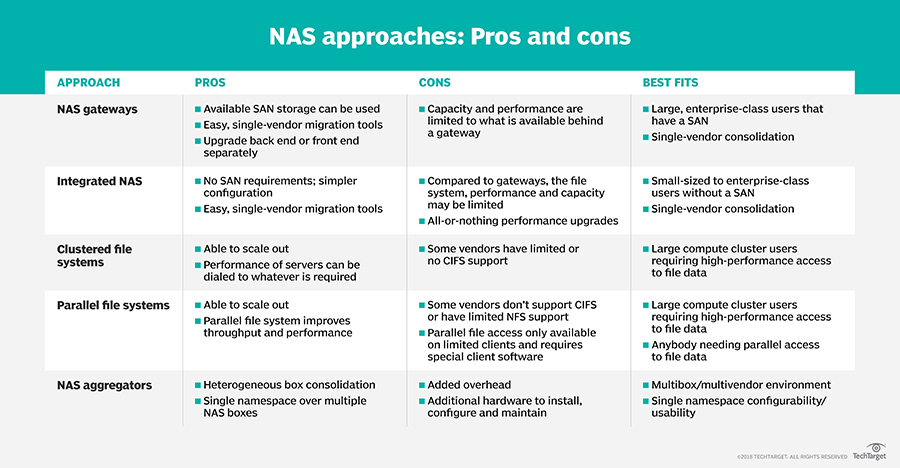

# The Ultimate Guide to Network-Attached Storage (NAS)

Network-Attached Storage (NAS) is a specialized storage device or server that connects to a network, allowing multiple users and devices to access and share files. It acts as a file server, providing a centralized storage location for data, which can be accessed by authorized users over a local area network (LAN) or the internet.

### Key Features of NAS

- **Centralized Storage**: NAS provides a centralized storage location for all your files, making it easy to access and manage data from multiple devices.
- **File Sharing**: NAS allows users to share files and folders with others, providing a collaborative environment for teams or households.
- **Data Redundancy**: NAS devices often support RAID (Redundant Array of Independent Disks) configurations, ensuring data redundancy and protection against disk failures.
- **Remote Access**: NAS devices can be accessed remotely, allowing users to access their files from anywhere with an internet connection.
- **Data Backup**: NAS devices often have built-in backup features, allowing users to schedule automatic backups of their important data.

## Benefits of Using NAS

Using NAS for storage and file sharing offers several advantages:

- **Centralized Storage**: NAS provides a single location to store and manage all your files, eliminating the need for multiple external hard drives or cloud storage subscriptions.
- **Data Security**: NAS devices offer robust security features, including user authentication, access controls, and encryption, ensuring the safety of your data.
- **Improved Performance**: NAS devices are designed for high-performance file sharing, allowing multiple users to access and transfer files simultaneously without any noticeable slowdowns.
- **Cost-Effective**: NAS devices are cost-effective solutions compared to building and maintaining a dedicated file server.
- **Scalability**: NAS devices can be easily expanded by adding additional hard drives or upgrading storage capacity, allowing for seamless scalability as your storage needs grow.

## Setting Up NAS

### Hardware Requirements

To set up a NAS, you will need the following hardware:

- **NAS Device**: Choose a NAS device that meets your storage requirements and supports the desired features.
- **Hard Drives**: Install one or more hard drives in the NAS device, depending on your storage needs.
- **Network Connection**: Connect the NAS device to your local network using an Ethernet cable.
- **Power Source**: Ensure that the NAS device is connected to a stable power source.

### Software Configuration

Once you have the necessary hardware, follow these steps to set up your NAS:

1. **Connect the NAS**: Connect the NAS device to your local network using an Ethernet cable.
2. **Power On**: Plug in the power cable and turn on the NAS device.
3. **Access the NAS Interface**: Open a web browser on a computer connected to the same network and enter the IP address or hostname of the NAS device to access the NAS interface.
4. **Create User Accounts**: Set up user accounts with appropriate permissions to access and manage the NAS.
5. **Configure Storage**: Set up the storage configuration, including RAID levels, disk formatting, and partitioning.
6. **Set up File Sharing**: Configure file sharing settings, including creating shared folders and setting access permissions.
7. **Enable Remote Access**: If desired, configure remote access settings to access your NAS from outside your local network.
8. **Data Backup**: Set up automatic backup schedules and configure backup destinations for your important data.

## Optimizing NAS Performance

To optimize the performance of your NAS, consider the following factors:

### Network Speed and Bandwidth

Ensure that your network infrastructure supports high-speed data transfer and has sufficient bandwidth to handle the expected workload. Use Gigabit Ethernet connections for optimal performance.

### RAID Configuration

Choose the appropriate RAID level for your NAS device based on your storage and redundancy requirements. RAID configurations such as RAID 5 or RAID 6 provide data redundancy and improved read and write performance.

### File System Optimization

Select the appropriate file system for your NAS device. File systems like ext4 or Btrfs offer better performance and data integrity compared to older file systems.

### Regular Maintenance

Perform regular maintenance tasks such as firmware updates, disk health checks, and system optimizations to ensure the smooth operation of your NAS.

### Backup Strategy

Implement a comprehensive backup strategy to protect your data from loss or corruption. Regularly back up your NAS data to external storage devices or cloud storage services.

## Frequently Asked Questions (FAQ)

### 1. Can I access my NAS remotely?

Yes, most NAS devicessupport remote access. By configuring the appropriate settings, you can access your NAS and your files from anywhere with an internet connection. This allows you to retrieve, upload, and manage your data even when you're not physically connected to your local network.

### 2. Can I expand the storage capacity of my NAS?

Yes, NAS devices are designed to be easily expandable. You can add additional hard drives to your NAS or upgrade the existing drives to increase the storage capacity. Some NAS devices even support external storage expansion via USB or eSATA ports.

### 3. How secure is NAS?

NAS devices offer robust security features to protect your data. They support user authentication, access controls, and encryption to ensure that only authorized users can access the files. It is important to set strong passwords and regularly update the firmware of your NAS device to stay protected against potential security vulnerabilities.

### 4. Can I use NAS for multimedia streaming?

Yes, many NAS devices come with built-in multimedia streaming capabilities. They support popular media server applications like Plex or Emby, allowing you to stream movies, music, and photos to compatible devices such as smart TVs, gaming consoles, or mobile devices.

### 5. Can I use NAS for backup purposes?

Absolutely! NAS devices often have built-in backup features that allow you to schedule automatic backups of your important data. You can back up your NAS data to external hard drives connected to the NAS or even to cloud storage services for an additional layer of data protection.

## Conclusion

Network-Attached Storage (NAS) is a powerful storage solution that provides centralized file storage, sharing, and data management. With its numerous features and benefits, NAS offers a cost-effective and scalable solution for individuals, small businesses, and even large enterprises. By following the setup and optimization guidelines in this guide, you can maximize the performance and efficiency of your NAS device. Embrace the convenience and security of NAS and take control of your data storage needs.

Remember, a well-optimized NAS setup can greatly enhance your productivity and data management capabilities. So, invest in a reliable NAS device, configure it properly, and enjoy the benefits of centralized storage and seamless file sharing.
