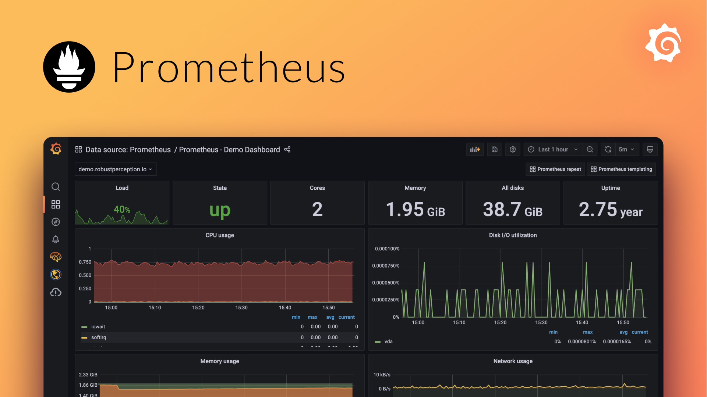
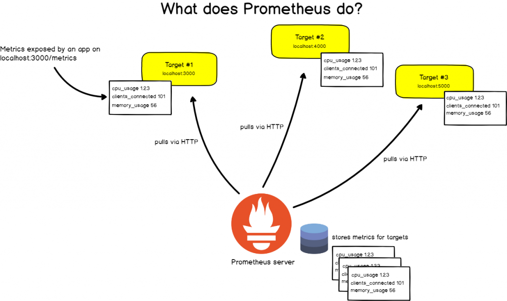
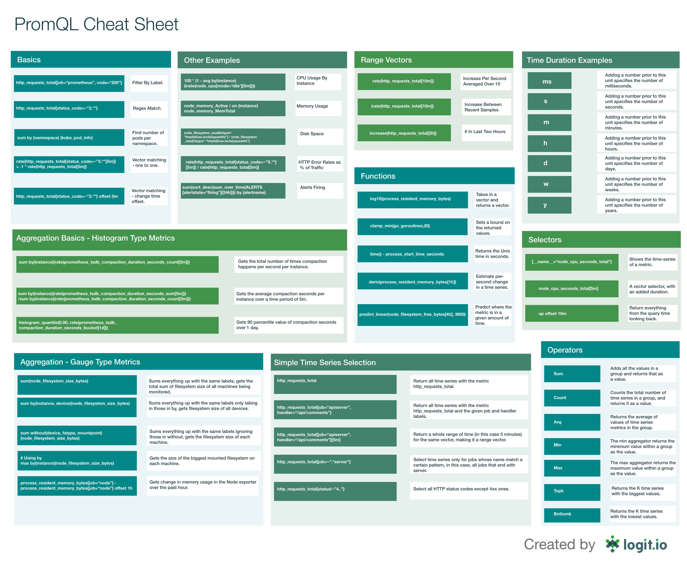

# Prometheus: Empowering Monitoring and Alerting in the Modern Era

In today's fast-paced and complex technological landscape, monitoring and alerting have become crucial for maintaining the health and performance of systems. Prometheus, an open-source monitoring and alerting toolkit, has emerged as a leading solution for collecting and analyzing metrics from various sources. With its powerful querying language, flexible data model, and robust alerting capabilities, Prometheus enables organizations to gain deep insights into their systems and proactively respond to anomalies.

In this comprehensive article, we will explore the features and benefits of Prometheus, provide a step-by-step guide on setting it up, and discuss how it can revolutionize your monitoring and alerting practices.

## Table of Contents

1. [What is Prometheus?](#what-is-prometheus)
2. [Why Choose Prometheus?](#why-choose-prometheus)
3. [Setting Up Prometheus](#setting-up-prometheus)
4. [Data Collection and Metrics](#data-collection-and-metrics)
5. [PromQL: Prometheus Query Language](#promql-prometheus-query-language)
6. [Alerting with Prometheus](#alerting-with-prometheus)
7. [Integration with Grafana](#integration-with-grafana)

## What is Prometheus?

Prometheus is an open-source monitoring and alerting toolkit originally developed at SoundCloud. It is designed to collect, store, and analyze time-series data, making it ideal for monitoring and observability purposes. Prometheus follows a pull-based model, where it scrapes metrics from various targets at regular intervals. These targets can include applications, services, operating systems, and even other monitoring systems. Once collected, Prometheus stores the metrics in a time-series database and provides a powerful querying language, PromQL, for analyzing and visualizing the data.

## Why Choose Prometheus?

Prometheus has gained significant popularity in the monitoring and observability space for several reasons:

1. **Flexible Data Model**: Prometheus utilizes a flexible data model based on key-value pairs, allowing it to handle a wide range of metrics. It supports numeric, string, and boolean metrics, as well as multi-dimensional labels that provide additional context to the data. This flexibility enables users to capture and analyze complex system behavior effectively.

2. **Robust Querying Language**: PromQL, the querying language of Prometheus, provides a rich set of functions and operators for analyzing time-series data. It allows users to perform aggregations, transformations, and filtering operations, empowering them to derive valuable insights from their metrics. PromQL's intuitive syntax and powerful capabilities make it a favorite among data analysts and operators.

3. **Scalability and Performance**: Prometheus is designed to handle large-scale deployments and high-frequency data ingestion. It employs a distributed architecture that allows for horizontal scalability by adding additional Prometheus instances. The time-series database is optimized for efficient storage and querying, ensuring fast and reliable access to metrics even in high-volume environments.

4. **Powerful Alerting System**: Prometheus comes with a built-in alerting system that allows users to define and manage alerts based on their metrics. Alerts can be configured using PromQL expressions, and users can specify conditions, thresholds, and notification channels. Prometheus can send alerts via email, PagerDuty, or other integrations, enabling proactive incident response and resolution.

5. **Vibrant Ecosystem**: Prometheus has a thriving ecosystem of exporters, integrations, and community-driven projects. Exporters allow users to collect metrics from various systems and applications, while integrations enable seamless integration with popular tools like Grafana for data visualization. The active community ensures continuous development and improvement of Prometheus, making it a future-proof choice for monitoring needs.

## Setting Up Prometheus

Setting up Prometheus involves the following steps:

1. **Choose an Installation Method**: Prometheus can be installed on-premises or in the cloud. You can opt for a standalone installation or utilize managed services like Prometheus Operator or Thanos. Choose the installation method that best suits your requirements and infrastructure.

2. **Configure Prometheus Server**: Configure the Prometheus server by specifying the scrape targets, which are the endpoints from which Prometheus will collect metrics. These targets can be applications, services, or even other Prometheus instances. Additionally, configure the retention period for metrics storage and other server-specific settings.

3. **Define Alerting Rules**: Create alerting rules to define conditions that trigger alerts. Alerting rules are written in PromQL and can be based on specific metrics, thresholds, or patterns. Specify the notification channels where alerts should be sent, such as email, Slack, or other integrations.

4. **Configure Service Discovery**: Prometheus supports various service discovery mechanisms to dynamically discover scrape targets. You can use static configuration files, DNS-based servicediscovery, Kubernetes service discovery, or other custom mechanisms. Configure the appropriate service discovery method based on your infrastructure and monitoring needs.

5. **Install and Configure Exporters**: Prometheus relies on exporters to collect metrics from different systems and applications. Install and configure exporters for the specific targets you want to monitor. Exporters are available for popular systems like Node.js, MySQL, Redis, and more.

6. **Verify and Test Configuration**: Once the Prometheus server and exporters are set up, verify the configuration by checking if metrics are being scraped correctly. Test the alerting rules by triggering specific conditions and ensuring that alerts are generated and sent to the configured channels.

7. **Monitor and Fine-tune**: Monitor the Prometheus server and the overall monitoring system to ensure its stability and performance. Fine-tune the configuration as needed to optimize resource usage and improve the accuracy of alerts.

## Data Collection and Metrics

Prometheus collects metrics from various sources using exporters. Exporters are small applications or libraries that expose metrics in a format that Prometheus can understand. These metrics can be related to system performance, application behavior, network activity, or any other aspect of the monitored environment.

Prometheus supports four types of metrics:

1. **Counter**: A counter is a monotonically increasing value that represents a cumulative count. It can only increase or be reset to zero. Counters are useful for tracking the number of requests, errors, or any other event that can be counted.

2. **Gauge**: A gauge is a value that can increase or decrease over time. It represents a snapshot of a particular value at a given moment. Gauges are suitable for measuring things like CPU usage, memory consumption, or any other metric that can vary.

3. **Histogram**: A histogram samples observations and counts them in configurable buckets. It provides statistical information about the distribution of values over a given time period. Histograms are useful for measuring response times, request durations, or any metric that needs to be analyzed in a distribution.

4. **Summary**: A summary is similar to a histogram, but it calculates quantiles instead of buckets. It provides information about the distribution of values and allows for calculating percentiles. Summaries are useful for measuring latency, request durations, or any metric that requires percentile analysis.

Prometheus metrics are identified by a unique combination of a metric name and a set of key-value pairs called labels. Labels provide additional context to the metric and allow for more granular analysis and filtering. For example, a metric named "http_requests_total" can have labels like "method" and "status_code" to differentiate between different types of requests.

## PromQL: Prometheus Query Language

PromQL is the powerful querying language of Prometheus that allows users to analyze and extract insights from the collected metrics. It provides a wide range of functions and operators for performing aggregations, transformations, and filtering operations on time-series data.

Here are some examples of PromQL queries:

- **Count the total number of HTTP requests**: `http_requests_total`

- **Calculate the average CPU usage over the last 5 minutes**: `avg(cpu_usage{instance="webserver"})[5m]`

- **Get the 90th percentile of response times for a specific endpoint**: `histogram_quantile(0.9, sum(rate(http_response_time_bucket{endpoint="/api"}[5m])) by (le))`

PromQL queries can be used to create dashboards, generate reports, or trigger alerts based on specific conditions. The flexibility and expressiveness of PromQL make it a valuable tool for monitoring and observability.

## Alerting with Prometheus

Prometheus comes with a built-in alerting system that allows users to define and manage alerts based on their metrics. Alerts are triggered when specific conditions or thresholds are met, and they can be sent to various notification channels like email, Slack, PagerDuty, or other integrations.

To set up alerts in Prometheus, follow these steps:

1. **Define Alerting Rules**: Write PromQL expressions that define the conditions for triggering alerts. For example, you can create an alert rule that triggers when the CPU usage exceeds a certain threshold for a specific duration.

2. **Configure Alertmanager**: Alertmanager is the component responsible for handling alerts in Prometheus. Configure the notification channels where alerts should be sent, such as email, Slack, or other integrations. Define the routing and grouping rules to ensure alerts are delivered to the appropriate recipients.

3. **Test and Validate Alerts**: Test the alerting rules by simulating specific conditions and verifying that alerts are generated and sent correctly. Validate the notification channels to ensure alerts reach the intended recipients.

Alerting with Prometheus enables proactive incident response and resolution. By defining and managing alerts based on key metrics, organizations can detect and address issues before they escalate, minimizing downtime and optimizing system performance.

## Integrating Prometheus with Grafana

To integrate Prometheus with Grafana, follow these steps:

1. **Install Prometheus**: Start by installing Prometheus on your system. Prometheus provides pre-compiled binaries for various operating systems, or you can use a containerized version. Configure Prometheus to scrape the metrics from your desired targets, such as applications or infrastructure components.

2. **Install Grafana**: Next, install Grafana on your system. Grafana also provides pre-compiled binaries and containerized versions. Once installed, access the Grafana web interface.

3. **Add Prometheus as a Data Source**: In the Grafana web interface, navigate to the Configuration section and select "Data Sources". Click on "Add data source" and choose Prometheus as the type. Provide the necessary details, such as the URL of your Prometheus server.

4. **Create Dashboards**: With Prometheus added as a data source, you can now create dashboards in Grafana. Navigate to the Dashboards section and click on "New Dashboard". Choose the visualization type, select Prometheus as the data source, and start building your dashboard by adding panels, graphs, and other visual elements.

5. **Customize and Share**: Grafana provides extensive customization options to fine-tune your dashboards. You can customize the layout, colors, and styles to match your preferences. Once your dashboard is ready, you can share it with others by exporting it as a JSON file or by providing a direct link.

## Benefits of Prometheus and Grafana Integration

The integration of Prometheus with Grafana offers several benefits:

1. **Powerful Monitoring**: Prometheus provides a robust monitoring system with advanced querying capabilities, allowing you to collect and analyze metrics from various sources. Grafana complements this by providing a visually appealing and customizable interface to display the collected data.

2. **Real-time Visualization**: Grafana allows you to create real-time dashboards that update dynamically as new data is received from Prometheus. This enables you to monitor your systems and applications in real-time, making it easier to identify and respond to issues promptly.

3. **Alerting and Notifications**: Prometheus has built-in alerting capabilities, allowing you to define alert rules based on specific conditions. When an alert is triggered, Prometheus can send notifications to various channels, such as email or messaging platforms. Grafana can also integrate with Prometheus alerts, providing a unified monitoring and alerting solution.

4. **Community and Ecosystem**: Both Prometheus and Grafana have vibrant communities and extensive ecosystems. This means you can benefit from a wide range of pre-built dashboards, plugins, and integrations created by the community. You can leverage these resources to enhance your monitoring and visualization capabilities.
