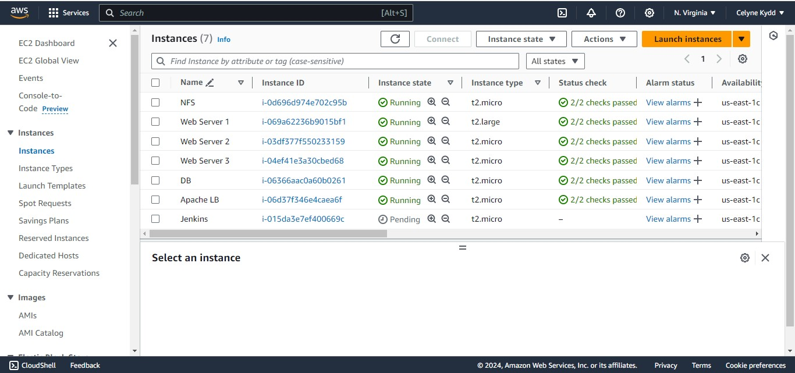
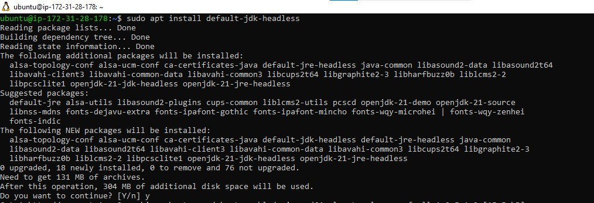
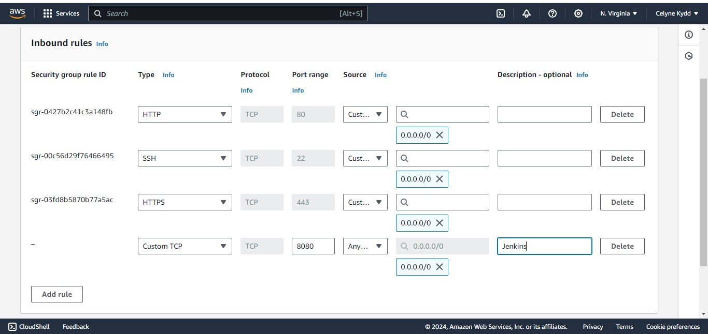
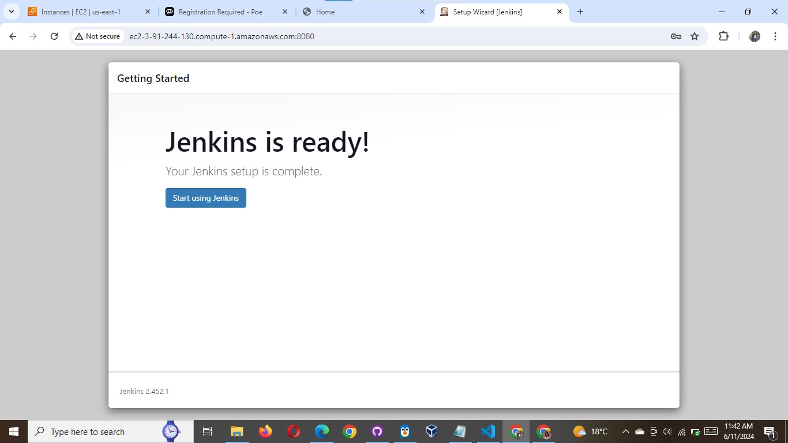
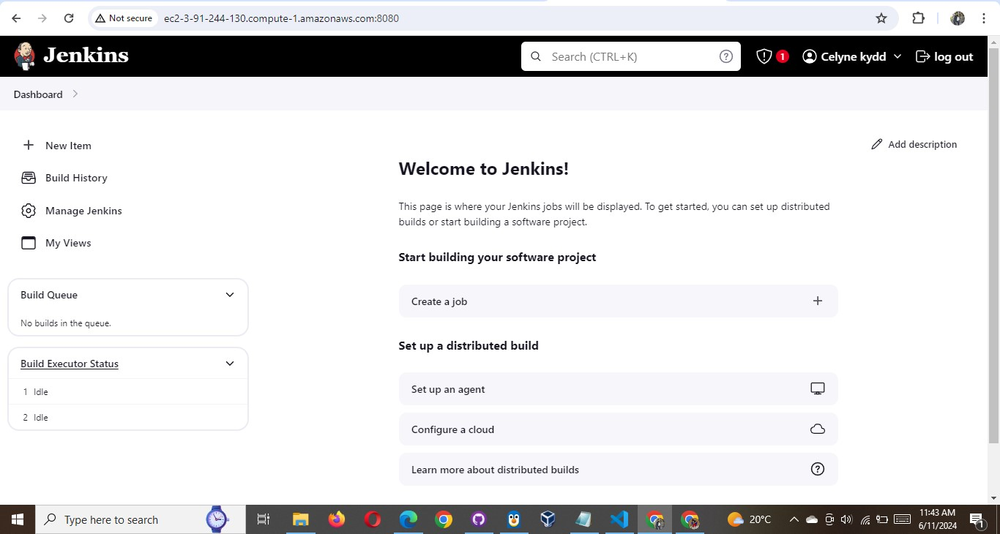

# INSTALL AND CONFIGURE JENKINS SERVER

Step 1 – Install Jenkins server

1. Create an AWS EC2 server based on Ubuntu Server 20.04 LTS and name it "Jenkins"



2. Install JDK (since Jenkins is a Java-based application)

```
sudo apt update
sudo apt install default-jdk-headless
```



3. Install Jenkins

```
wget -q -O - https://pkg.jenkins.io/debian-stable/jenkins.io.key | sudo apt-key add -
sudo sh -c 'echo deb https://pkg.jenkins.io/debian-stable binary/ > \
    /etc/apt/sources.list.d/jenkins.list'
sudo apt update
sudo apt-get install jenkins
```

Make sure Jenkins is up and running

```
sudo systemctl status jenkins
```


4. By default Jenkins server uses TCP port 8080 – open it by creating a new Inbound Rule in your EC2 Security Group



5. Perform initial Jenkins setup.
   From your browser access http://<Jenkins-Server-Public-IP-Address-or-Public-DNS-Name>:8080

You will be prompted to provide a default admin password


Retrieve it from your server:

```
sudo cat /var/lib/jenkins/secrets/initialAdminPassword
```

Then you will be asked which plugings to install – choose suggested plugins.


Once plugins installation is done – create an admin user and you will get your Jenkins server address.

The installation is completed!




